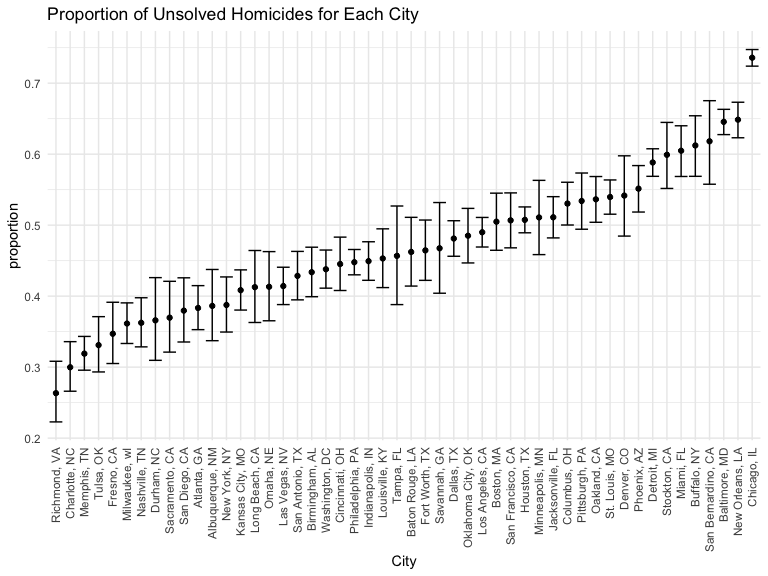

P8105 Homework 5
================

## Problem 1

The code chunk below imports the data in individual spreadsheets
contained in `./data/zip_data/`. To do this, I create a dataframe that
includes the list of all files in that directory and the complete path
to each file. As a next step, I `map` over paths and import data using
the `read_csv` function. Finally, I `unnest` the result of `map`.

``` r
full_df = 
  tibble(
    files = list.files("data/zip_data/"),
    path = str_c("data/zip_data/", files)
  ) %>% 
  mutate(data = map(path, read_csv)) %>% 
  unnest()
```

    ## Rows: 1 Columns: 8
    ## ── Column specification ────────────────────────────────────────────────────────
    ## Delimiter: ","
    ## dbl (8): week_1, week_2, week_3, week_4, week_5, week_6, week_7, week_8
    ## 
    ## ℹ Use `spec()` to retrieve the full column specification for this data.
    ## ℹ Specify the column types or set `show_col_types = FALSE` to quiet this message.
    ## Rows: 1 Columns: 8
    ## ── Column specification ────────────────────────────────────────────────────────
    ## Delimiter: ","
    ## dbl (8): week_1, week_2, week_3, week_4, week_5, week_6, week_7, week_8
    ## 
    ## ℹ Use `spec()` to retrieve the full column specification for this data.
    ## ℹ Specify the column types or set `show_col_types = FALSE` to quiet this message.
    ## Rows: 1 Columns: 8
    ## ── Column specification ────────────────────────────────────────────────────────
    ## Delimiter: ","
    ## dbl (8): week_1, week_2, week_3, week_4, week_5, week_6, week_7, week_8
    ## 
    ## ℹ Use `spec()` to retrieve the full column specification for this data.
    ## ℹ Specify the column types or set `show_col_types = FALSE` to quiet this message.
    ## Rows: 1 Columns: 8
    ## ── Column specification ────────────────────────────────────────────────────────
    ## Delimiter: ","
    ## dbl (8): week_1, week_2, week_3, week_4, week_5, week_6, week_7, week_8
    ## 
    ## ℹ Use `spec()` to retrieve the full column specification for this data.
    ## ℹ Specify the column types or set `show_col_types = FALSE` to quiet this message.
    ## Rows: 1 Columns: 8
    ## ── Column specification ────────────────────────────────────────────────────────
    ## Delimiter: ","
    ## dbl (8): week_1, week_2, week_3, week_4, week_5, week_6, week_7, week_8
    ## 
    ## ℹ Use `spec()` to retrieve the full column specification for this data.
    ## ℹ Specify the column types or set `show_col_types = FALSE` to quiet this message.
    ## Rows: 1 Columns: 8
    ## ── Column specification ────────────────────────────────────────────────────────
    ## Delimiter: ","
    ## dbl (8): week_1, week_2, week_3, week_4, week_5, week_6, week_7, week_8
    ## 
    ## ℹ Use `spec()` to retrieve the full column specification for this data.
    ## ℹ Specify the column types or set `show_col_types = FALSE` to quiet this message.
    ## Rows: 1 Columns: 8
    ## ── Column specification ────────────────────────────────────────────────────────
    ## Delimiter: ","
    ## dbl (8): week_1, week_2, week_3, week_4, week_5, week_6, week_7, week_8
    ## 
    ## ℹ Use `spec()` to retrieve the full column specification for this data.
    ## ℹ Specify the column types or set `show_col_types = FALSE` to quiet this message.
    ## Rows: 1 Columns: 8
    ## ── Column specification ────────────────────────────────────────────────────────
    ## Delimiter: ","
    ## dbl (8): week_1, week_2, week_3, week_4, week_5, week_6, week_7, week_8
    ## 
    ## ℹ Use `spec()` to retrieve the full column specification for this data.
    ## ℹ Specify the column types or set `show_col_types = FALSE` to quiet this message.
    ## Rows: 1 Columns: 8
    ## ── Column specification ────────────────────────────────────────────────────────
    ## Delimiter: ","
    ## dbl (8): week_1, week_2, week_3, week_4, week_5, week_6, week_7, week_8
    ## 
    ## ℹ Use `spec()` to retrieve the full column specification for this data.
    ## ℹ Specify the column types or set `show_col_types = FALSE` to quiet this message.
    ## Rows: 1 Columns: 8
    ## ── Column specification ────────────────────────────────────────────────────────
    ## Delimiter: ","
    ## dbl (8): week_1, week_2, week_3, week_4, week_5, week_6, week_7, week_8
    ## 
    ## ℹ Use `spec()` to retrieve the full column specification for this data.
    ## ℹ Specify the column types or set `show_col_types = FALSE` to quiet this message.
    ## Rows: 1 Columns: 8
    ## ── Column specification ────────────────────────────────────────────────────────
    ## Delimiter: ","
    ## dbl (8): week_1, week_2, week_3, week_4, week_5, week_6, week_7, week_8
    ## 
    ## ℹ Use `spec()` to retrieve the full column specification for this data.
    ## ℹ Specify the column types or set `show_col_types = FALSE` to quiet this message.
    ## Rows: 1 Columns: 8
    ## ── Column specification ────────────────────────────────────────────────────────
    ## Delimiter: ","
    ## dbl (8): week_1, week_2, week_3, week_4, week_5, week_6, week_7, week_8
    ## 
    ## ℹ Use `spec()` to retrieve the full column specification for this data.
    ## ℹ Specify the column types or set `show_col_types = FALSE` to quiet this message.
    ## Rows: 1 Columns: 8
    ## ── Column specification ────────────────────────────────────────────────────────
    ## Delimiter: ","
    ## dbl (8): week_1, week_2, week_3, week_4, week_5, week_6, week_7, week_8
    ## 
    ## ℹ Use `spec()` to retrieve the full column specification for this data.
    ## ℹ Specify the column types or set `show_col_types = FALSE` to quiet this message.
    ## Rows: 1 Columns: 8
    ## ── Column specification ────────────────────────────────────────────────────────
    ## Delimiter: ","
    ## dbl (8): week_1, week_2, week_3, week_4, week_5, week_6, week_7, week_8
    ## 
    ## ℹ Use `spec()` to retrieve the full column specification for this data.
    ## ℹ Specify the column types or set `show_col_types = FALSE` to quiet this message.
    ## Rows: 1 Columns: 8
    ## ── Column specification ────────────────────────────────────────────────────────
    ## Delimiter: ","
    ## dbl (8): week_1, week_2, week_3, week_4, week_5, week_6, week_7, week_8
    ## 
    ## ℹ Use `spec()` to retrieve the full column specification for this data.
    ## ℹ Specify the column types or set `show_col_types = FALSE` to quiet this message.
    ## Rows: 1 Columns: 8
    ## ── Column specification ────────────────────────────────────────────────────────
    ## Delimiter: ","
    ## dbl (8): week_1, week_2, week_3, week_4, week_5, week_6, week_7, week_8
    ## 
    ## ℹ Use `spec()` to retrieve the full column specification for this data.
    ## ℹ Specify the column types or set `show_col_types = FALSE` to quiet this message.
    ## Rows: 1 Columns: 8
    ## ── Column specification ────────────────────────────────────────────────────────
    ## Delimiter: ","
    ## dbl (8): week_1, week_2, week_3, week_4, week_5, week_6, week_7, week_8
    ## 
    ## ℹ Use `spec()` to retrieve the full column specification for this data.
    ## ℹ Specify the column types or set `show_col_types = FALSE` to quiet this message.
    ## Rows: 1 Columns: 8
    ## ── Column specification ────────────────────────────────────────────────────────
    ## Delimiter: ","
    ## dbl (8): week_1, week_2, week_3, week_4, week_5, week_6, week_7, week_8
    ## 
    ## ℹ Use `spec()` to retrieve the full column specification for this data.
    ## ℹ Specify the column types or set `show_col_types = FALSE` to quiet this message.
    ## Rows: 1 Columns: 8
    ## ── Column specification ────────────────────────────────────────────────────────
    ## Delimiter: ","
    ## dbl (8): week_1, week_2, week_3, week_4, week_5, week_6, week_7, week_8
    ## 
    ## ℹ Use `spec()` to retrieve the full column specification for this data.
    ## ℹ Specify the column types or set `show_col_types = FALSE` to quiet this message.
    ## Rows: 1 Columns: 8
    ## ── Column specification ────────────────────────────────────────────────────────
    ## Delimiter: ","
    ## dbl (8): week_1, week_2, week_3, week_4, week_5, week_6, week_7, week_8
    ## 
    ## ℹ Use `spec()` to retrieve the full column specification for this data.
    ## ℹ Specify the column types or set `show_col_types = FALSE` to quiet this message.

The result of the previous code chunk isn’t tidy – data are wide rather
than long, and some important variables are included as parts of others.
The code chunk below tides the data using string manipulations on the
file, converting from wide to long, and selecting relevant variables.

``` r
tidy_df = 
  full_df %>% 
  mutate(
    files = str_replace(files, ".csv", ""),
    group = str_sub(files, 1, 3)) %>% 
  pivot_longer(
    week_1:week_8,
    names_to = "week",
    values_to = "outcome",
    names_prefix = "week_") %>% 
  mutate(week = as.numeric(week)) %>% 
  select(group, subj = files, week, outcome)
```

Finally, the code chunk below creates a plot showing individual data,
faceted by group.

``` r
tidy_df %>% 
  ggplot(aes(x = week, y = outcome, group = subj, color = subj)) + 
  geom_point() + 
  geom_path() + 
  facet_grid(~group)
```


This plot suggests high within-subject correlation – subjects who start
above average end up above average, and those that start below average
end up below average. Subjects in the control group generally don’t
change over time, but those in the experiment group increase their
outcome in a roughly linear way.

## Problem 2

``` r
homicide_data = read_csv("./data/homicide_data.csv")
```

    ## Rows: 52179 Columns: 12
    ## ── Column specification ────────────────────────────────────────────────────────
    ## Delimiter: ","
    ## chr (9): uid, victim_last, victim_first, victim_race, victim_age, victim_sex...
    ## dbl (3): reported_date, lat, lon
    ## 
    ## ℹ Use `spec()` to retrieve the full column specification for this data.
    ## ℹ Specify the column types or set `show_col_types = FALSE` to quiet this message.

``` r
homicide_data
```

    ## # A tibble: 52,179 × 12
    ##    uid   repor…¹ victi…² victi…³ victi…⁴ victi…⁵ victi…⁶ city  state   lat   lon
    ##    <chr>   <dbl> <chr>   <chr>   <chr>   <chr>   <chr>   <chr> <chr> <dbl> <dbl>
    ##  1 Alb-…  2.01e7 GARCIA  JUAN    Hispan… 78      Male    Albu… NM     35.1 -107.
    ##  2 Alb-…  2.01e7 MONTOYA CAMERON Hispan… 17      Male    Albu… NM     35.1 -107.
    ##  3 Alb-…  2.01e7 SATTER… VIVIANA White   15      Female  Albu… NM     35.1 -107.
    ##  4 Alb-…  2.01e7 MENDIO… CARLOS  Hispan… 32      Male    Albu… NM     35.1 -107.
    ##  5 Alb-…  2.01e7 MULA    VIVIAN  White   72      Female  Albu… NM     35.1 -107.
    ##  6 Alb-…  2.01e7 BOOK    GERALD… White   91      Female  Albu… NM     35.2 -107.
    ##  7 Alb-…  2.01e7 MALDON… DAVID   Hispan… 52      Male    Albu… NM     35.1 -107.
    ##  8 Alb-…  2.01e7 MALDON… CONNIE  Hispan… 52      Female  Albu… NM     35.1 -107.
    ##  9 Alb-…  2.01e7 MARTIN… GUSTAVO White   56      Male    Albu… NM     35.1 -107.
    ## 10 Alb-…  2.01e7 HERRERA ISRAEL  Hispan… 43      Male    Albu… NM     35.1 -107.
    ## # … with 52,169 more rows, 1 more variable: disposition <chr>, and abbreviated
    ## #   variable names ¹​reported_date, ²​victim_last, ³​victim_first, ⁴​victim_race,
    ## #   ⁵​victim_age, ⁶​victim_sex
    ## # ℹ Use `print(n = ...)` to see more rows, and `colnames()` to see all variable names

This raw dataset contains 52179 rows and 12 columns. Important variables
include date, state, city, disposition, and information about victims
such as race, age, sex, and names, etc. Each raw represents one single
homicide case.

Create a city_state variable (e.g. “Baltimore, MD”) and then summarize
within cities to obtain the total number of homicides and the number of
unsolved homicides (those for which the disposition is “Closed without
arrest” or “Open/No arrest”).

``` r
homicide = homicide_data %>% 
  mutate(
    city_state = str_c(city, ', ', state)
  )

total_num = homicide %>% 
  group_by(city_state) %>% 
  summarize(
    total = n(),
  )

unsolved_num = homicide %>% 
  filter(disposition %in% c("Closed without arrest", "Open/No arrest")) %>% 
  group_by(city_state) %>% 
  summarize(
    unsolved = n()
  )

summary = inner_join(unsolved_num, total_num, by = "city_state")
```

For the city of Baltimore, MD, use the prop.test function to estimate
the proportion of homicides that are unsolved; save the output of
prop.test as an R object, apply the broom::tidy to this object.

``` r
Baltimore_test = summary %>% 
  filter(city_state == "Baltimore, MD")

Baltimore_test =  
  prop.test(Baltimore_test[["unsolved"]], Baltimore_test[["total"]]) %>% 
  broom::tidy()
```

Pull the estimated proportion and confidence intervals from the
resulting tidy dataframe.

``` r
Baltimore_test %>% 
  select(estimate, conf_low = conf.low, conf_high = conf.high) %>% 
  knitr::kable()
```

|  estimate |  conf_low | conf_high |
|----------:|----------:|----------:|
| 0.6455607 | 0.6275625 | 0.6631599 |

Now run prop.test for each of the cities in your dataset, and extract
both the proportion of unsolved homicides and the confidence interval
for each. Do this within a “tidy” pipeline, making use of purrr::map,
purrr::map2, list columns and unnest as necessary to create a tidy
dataframe with estimated proportions and CIs for each city.

Firstly, write a function:

``` r
city_test = function(df) {
  
    prop.test(df[["unsolved"]], df[["total"]]) %>% 
    broom::tidy() %>% 
    select(estimate, conf_low = conf.low, conf_high = conf.high)
  
}
```

Apply this function to the `summary` dataframe:

``` r
test_outcome = 
  summary %>% 
  nest(unsolved:total) %>% 
  mutate(
    outcome = map(data, city_test)
  ) %>% 
  unnest(outcome) %>% 
  select(-data)

head(test_outcome) %>% 
  knitr::kable()
```

| city_state      |  estimate |  conf_low | conf_high |
|:----------------|----------:|----------:|----------:|
| Albuquerque, NM | 0.3862434 | 0.3372604 | 0.4375766 |
| Atlanta, GA     | 0.3833505 | 0.3528119 | 0.4148219 |
| Baltimore, MD   | 0.6455607 | 0.6275625 | 0.6631599 |
| Baton Rouge, LA | 0.4622642 | 0.4141987 | 0.5110240 |
| Birmingham, AL  | 0.4337500 | 0.3991889 | 0.4689557 |
| Boston, MA      | 0.5048860 | 0.4646219 | 0.5450881 |

Create a plot that shows the estimates and CIs for each city – check out
geom_errorbar for a way to add error bars based on the upper and lower
limits. Organize cities according to the proportion of unsolved
homicides.

``` r
test_outcome %>% 
  mutate(
    city_state = fct_reorder(city_state, estimate)
  ) %>% 
  ggplot(aes(x = city_state, y = estimate)) +
  geom_point() +
  geom_errorbar(aes(ymin = conf_low, ymax = conf_high)) +
  theme(axis.text.x = element_text(
      angle = 90, vjust = 0.5, hjust = 1)) +
  labs(
    title = "Proportion of Unsolved Homicides for Each City",
    x = "City",
    y = "proportion"
  )
```



According to this plot, Richmond has the lowest proportion of unsolved
homicides, while Chicago has the highest.

## Problem 3

First set the following design elements:

-   Fix n=30

-   Fix σ=5

Set μ = 0. Generate 5000 datasets from the model x ∼ Normal\[μ,σ\].

For each dataset, save μ̂ and the p-value arising from a test of H:μ=0
using α=0.05.

First write a function:

``` r
sim_t_test = function(true_mean) {
  sample = rnorm(30, mean = true_mean, sd = 5)
  
  t.test(sample) %>% 
    broom::tidy() %>% 
    select(estimate, p_value = p.value)
}
```

Set μ = 0. Generate 5000 datasets from the model x ∼ Normal\[μ,σ\].

``` r
sim_results_df1 = 
  expand_grid(
    mu = 0,
    iteration = 1:5000
  ) %>% 
  mutate(
    result = map(mu, sim_t_test)
  ) %>% 
  unnest(result)
```

Repeat the above for μ={1,2,3,4,5,6}:

``` r
sim_results_df2 = 
  expand_grid(
    mu = 1:6,
    iteration = 1:5000
  ) %>% 
  mutate(
    result = map(mu, sim_t_test)
  ) %>% 
  unnest(result) 
```

-   Make a plot showing the proportion of times the null was rejected
    (the power of the test) on the y axis and the true value of μ on the
    x axis. Describe the association between effect size and power.

``` r
plot_df = 
  sim_results_df2 %>% 
  group_by(mu) %>% 
  mutate(
    reject = ifelse(p_value < 0.05, TRUE, FALSE),
    power = mean(reject)
  )

plot_df %>% 
  ggplot(aes(x = mu, y = power)) +
  geom_point() +
  labs(
    title = "The Association Between Effect Size and Power",
    x = "True Mean",
    y = "Power"
  )
```


According to the plot, as true value of μ increases, the proportion of
times the null (μ=0) was rejected (the power of the test) is also
increasing. It shows that effect size and power are positively
associated.

-   Make a plot showing the average estimate of μ̂ on the y axis and the
    true value of μ on the x axis. Make a second plot (or overlay on the
    first) the average estimate of μ̂ only in samples for which the null
    was rejected on the y axis and the true value of μ on the x axis. Is
    the sample average of μ̂ across tests for which the null is rejected
    approximately equal to the true value of μ ? Why or why not?

``` r
avg_est = plot_df %>% 
  group_by(mu) %>%
  mutate(avg_mu_hat = mean(estimate)) %>% 
  ggplot(aes(x = mu, y = avg_mu_hat), color = "blue") +
  geom_point() +
  labs(
    x = "True Mean",
    y = "Average Estimate of Mean"
  ) 

rej_null = plot_df %>% 
  group_by(mu) %>%
  filter(reject == TRUE) %>% 
  mutate(avg_mu_hat1 = mean(estimate)) %>% 
  ggplot(aes(x = mu, y = avg_mu_hat1), color = "pink") +
  geom_point() +
  labs(
    x = "True Mean",
    y = "Average Estimate of Mean (with Null Rejected)"
  ) 

avg_est + rej_null
```


The sample average of μ̂ across tests for which the null is rejected is
not equal to the true value of μ, especially for those whose true mean
\<= 4. They are above the true mean, in that rejecting the null means
the effect size should be comparatively large. Therefore, tests from
samples with larger estimated mean are more likely to reject the null.
